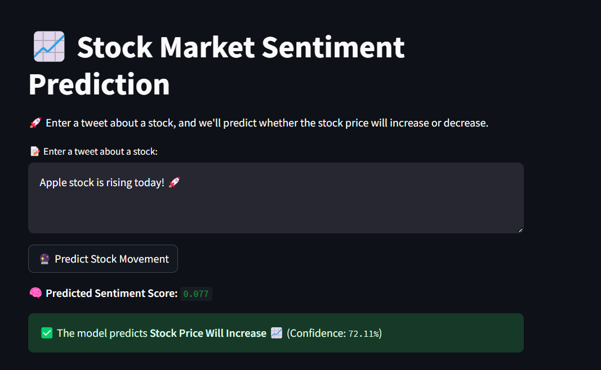

# 📘 Stock Market Sentiment Analysis

🚀 **Stock Market Sentiment Analysis & Prediction** is a **machine learning project** that predicts stock price movement using **Twitter sentiment analysis**. The project **analyzes tweets**, determines sentiment, and predicts if a stock will **increase 📈 or decrease 📉**.

---

## 📌 Features
✔ **Fetches stock-related tweets**

✔ **Performs sentiment analysis**  

✔ **Fetches historical stock prices**  

✔ **Applies ML models to predict stock movement**  

✔ **Streamlit web app for real-time predictions**  

---

## ☁️ Google Cloud Deployment  
This project is **deployed on Google Cloud Run** using **Cloud Storage** for model storage.

### **🔹 Cloud Services Used**
- **Google Cloud Run**: Serverless deployment of the Streamlit web app
- **Google Cloud Storage (GCS)**: Stores trained ML models (`.pkl` files)
- **Google IAM**: Manages permissions for Cloud Run to access GCS
- **Google Buildpacks**: Automates containerization for deployment

### **🔹 How to Deploy on Google Cloud**
1. **Enable Cloud Run & Storage API**

```bash
   gcloud services enable run.googleapis.com storage.googleapis.com
```

2. **Deploy App to Cloud Run**

```bash
   gcloud run deploy stock-sentiment-app --source . --region us-central1 --allow-unauthenticated
```

3. **Grant Storage Access to Cloud Run**

```bash
   gcloud projects add-iam-policy-binding stock-sentiment-data --member=serviceAccount:YOUR_CLOUD_RUN_SERVICE_ACCOUNT --role=roles/storage.objectViewer
```

🔗 **Live Web App:** [Stock Sentiment Prediction](https://stock-sentiment-app-975942960871.us-central1.run.app/)

## 📂 Project Structure

```
📁 Stock-Market-Sentiment-Analysis
│── 📁 data
│   ├── final_stock_sentiment.csv   # Final processed dataset
│   ├── tweets_sentiment.csv   # Tweet sentiments dataset
│   ├── sentiment_stock_data.csv   # Sentiment stock data
│── 📁 models
│   ├── best_stock_sentiment_model.pkl  # Trained RandomForest model
│   ├── scaler.pkl                      # Scaler for sentiment scores
│── 📁 notebooks
│   ├── eda.ipynb   # Visualization
│   ├── stock_data_analysis    # Stock data
│   ├── stock_sentiment_analysis    # Sentiment data
│── 📁 src
│   ├── app.py  # Run straeamlit web app
│   ├── model_train.py      # Train & save ML model
│── README.md               # Documentation
│── requirements.txt        # Python dependencies
│── .env       # Secret keys
│── .gitignore       # Ignore uploading some files
│── app.yaml       # Defines Cloud Run environment & entrypoint
│── Procfile       # Tells Google Buildpacks how to start Streamlit

```
## 📥 Installation
### 🔹 **Step 1: Clone the Repository**

```bash
git clone https://github.com/your-username/Stock-Market-Sentiment-Analysis.git
cd Stock-Market-Sentiment-Analysis
```

### 🔹 **Step 2: Setup Environment Variables**
Create a `.env` file in the root directory:
```ini
TWITTER_BEARER_TOKEN=xxxxxxxxxxxxxxxxxxxxxxx
```

### 🔹 **Step 3: Create & Activate Virtual Environment**

```bash
python -m venv venv
source venv/bin/activate  # Mac/Linux
venv\Scripts\activate     # Windows
```

### 🔹 **Step 4: Install Dependencies**

```bash
pip install -r requirements.txt
```

## 🛠 Data Processing
### **Fetch & Preprocess Data**

Run the scripts in the notebooks folder to: 

✅ Fetch stock data 📈

✅ Collect Twitter sentiment data 🐦

✅ Merge & clean dataset

## 🤖 Train Model
### **Train a RandomForestClassifier on stock movement vs. sentiment:**

```bash
python src/model_train.py
```

After training, it saves the model in **models/best_stock_sentiment_model.pkl**.

## 🌍 Run Streamlit Web App
### Launch the **interactive web app** to predict stock movement from tweets:

```bash
streamlit run app/app.py
```

📌 **Usage:** Enter a stock-related tweet → Get sentiment & stock movement prediction!

## 📊 Model Performance

Model: **RandomForestClassifier**
Features: Sentiment Score, Price Volatility, Tweet Count
**SMOTE applied** to balance training data

Accuracy: 📈 **50%**

The model achieved an accuracy of 50%, which is relatively low. This is primarily due to the limited amount of training data available.

* Some stock prices were missing for certain sentiment data points, leading to data gaps.

* The date alignment between sentiment data (tweets) and stock prices caused merging issues.

* Initially, the dataset was highly imbalanced, where one class had too few examples.

* I applied SMOTE to create more synthetic samples of the minority class.

* This improved the model's accuracy to 50%, but it’s still limited by the overall dataset size.

## 📌 Technologies Used
✅ Python

✅ scikit-learn - Machine Learning

✅ pandas - Data Processing

✅ yfinance - Stock Data API

✅ Tweepy - Twitter API

✅ Streamlit - Web Interface

✅ Google Cloud Run - Hosting & Deployment

✅ Google Cloud Storage - Model Storage

# 📜 License
📜 MIT License - Free to use, modify, and distribute.

# 🔗 Author & Contributions
👤 Emre Beray Boztepe


# 🚀 Testing

